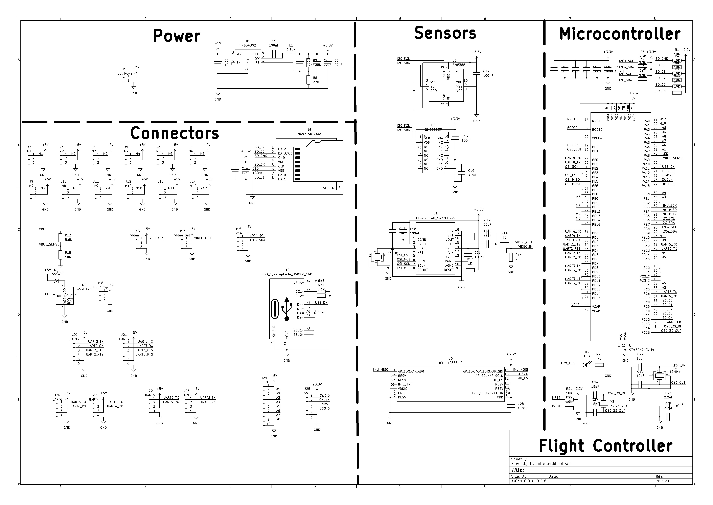

# Custom Flight Controller

This is a custom flight controller and camera system that I designed to be used with Ardupilot for a drone or airplane. 

## Features

* STM32H743 Microcontroller
* BMP388 Pressure Sensor
* LIS3MDLTR Magnetometetr
* ICM-42688 IMU
* OSD using MAX7456
* LED Strip
* 12 Motor Ouputs
* MicroSD Card
* 6 UARTs and 1 I2C

## Schematic

## PCB

## Render

## Schematic

I also designed a basic camera system to be used with it, using RX5808 and TX5823 modules

